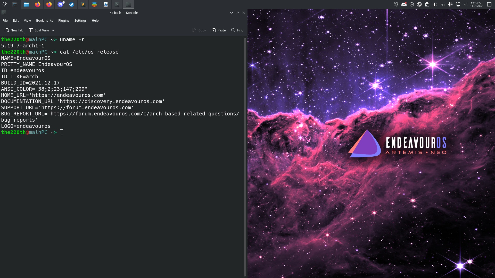

# ВВЕДЕНИЕ

Цель работы: изучение процесса установки и настройки ОС GNU/Linux.

Задание: Установка дистрибутива GNU/Linux и настройка IDE для работы с ЯП C/C++.

# Выполнение работы

Система GNU/Linux является основной, поэтому устанавливать систему на ПК не требуется. Как оснавная системя используется дистрибутив EndeavourOS на основе Arch. DE KDE для данного дистрибутива представлен на рисунке 1.



Как основное IDE для разработки программ на языке программирования C/C++ будет использоваться codium с плагином C/C++ for Visual Studio Code в связке с gcc. Пример установненного IDE представлен на рисунке 2.


Исходные текст тестовой программы:

``` cpp
#include <iostream>

int main()
{
    std::cout << "\"Hello world!\" is too corny. So, hello GNU/Linux. " << std::endl;
    return 0;
}
```

# ВЫВОД

В результате выполнение лабораторной работы было продемонстрировано, что GNU/Linux уже установлен, а также было выбрано основное IDE для работы с C/C++ для выполнения лабораторных работ в дальнейшем. 