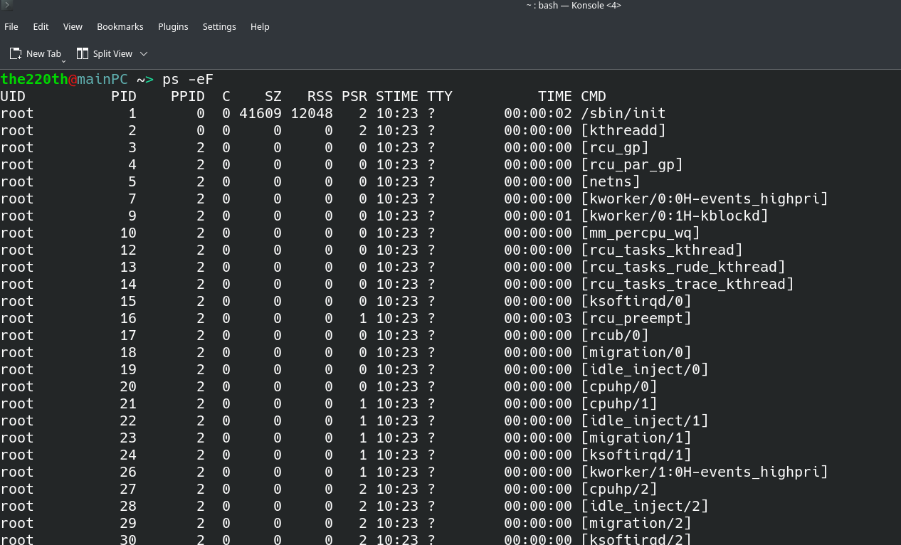
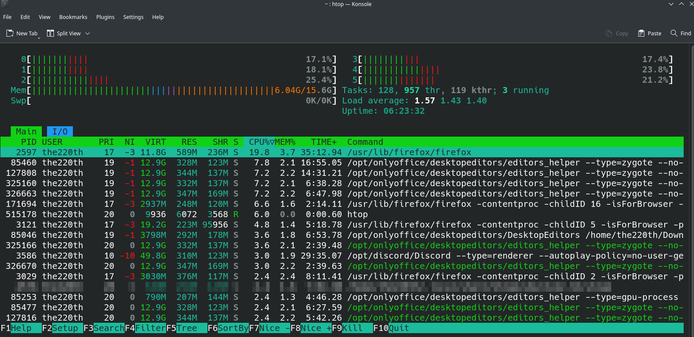
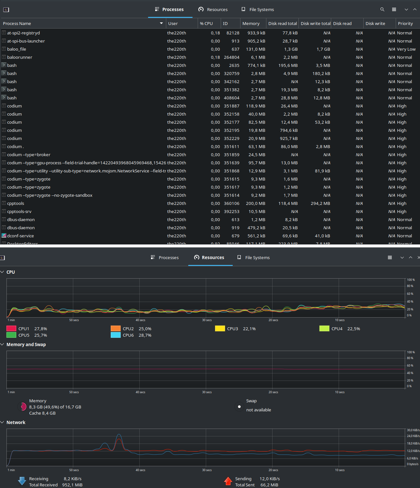

# ВВЕДЕНИЕ

Цель работы: Знакомство с командами и программами управления пользователями и мониторинга работы ОС GNU/Linux.

Задание: Проверка работоспособности терминала, запуск программы `Gnome System Monitor`. 

# Выполнение работы

## Пользователи и группы

Команды по добавлению и удалению пользователей и групп и вывод оболочки представлен в приложении А. 

## ps, htop

Вывод команды `ps -eF` представлен на рисунке 1.



Вывод утилиты `htop` представлен на рисунке 2.



Под PID, USER, PRI, NI, S, CPU, MEM, TIME понимаются следующий понятия:

- PID - идентификатор процесса
- USER - пользователь, от которого был запущен процесс
- PRI - приоритет процесса linux на уровне ядра (обычно NI+20)
- NI - nice процесса от -20 до 19
- S - состояние процесса
- CPU - используемые ресурсы процессора
- MEM - использованная память
- TIME - время работы процесса

<!-- https://habr.com/ru/post/316806/ -->

Раскодировка VIRT/RES/SHR/MEM:

- VIRT/VSZ (виртуальный образ) - включает в себя весь код, данные, общие библиотеки, страницы которые были перемещены на диск, а также страницы, которые проецировались ядром, но не были использованы. VIRT - это всё, что используется процессом.

- RES/RSS (резидентная память) - это область, которая не выгружена на диск и находится в оперативной памяти.

- SHR (разделяемая память) - это объём памяти, который может быть совместно использован другими процессами.

## Диспетчер задач

Для установки диспетчера задач на арче, можно выполнить команду:

``` bash
> yay gnome-system-monitor
```

Пример окна утилиты gnome-system-monitor представлен на рисунке 3.



# ВЫВОД

В результате выполнение лабораторной работы было произведено ознакомление с консольными командами, которые позволяют управлять пользователями, группами и процессами в GNU/Linux.

# Приложение А

``` bash
the220th@mainPC ~> sudo cat /etc/passwd
root:x:0:0::/root:/bin/bash
bin:x:1:1::/:/usr/bin/nologin
daemon:x:2:2::/:/usr/bin/nologin
mail:x:8:12::/var/spool/mail:/usr/bin/nologin
ftp:x:14:11::/srv/ftp:/usr/bin/nologin
http:x:33:33::/srv/http:/usr/bin/nologin
nobody:x:65534:65534:Nobody:/:/usr/bin/nologin
dbus:x:81:81:System Message Bus:/:/usr/bin/nologin
...
the220th:x:1000:1000:The220th:/home/the220th:/bin/bash
the220th@mainPC ~> sudo useradd -m -s /bin/bash buff
the220th@mainPC ~> sudo cat /etc/passwd
root:x:0:0::/root:/bin/bash
bin:x:1:1::/:/usr/bin/nologin
daemon:x:2:2::/:/usr/bin/nologin
mail:x:8:12::/var/spool/mail:/usr/bin/nologin
ftp:x:14:11::/srv/ftp:/usr/bin/nologin
http:x:33:33::/srv/http:/usr/bin/nologin
nobody:x:65534:65534:Nobody:/:/usr/bin/nologin
dbus:x:81:81:System Message Bus:/:/usr/bin/nologin
...
the220th:x:1000:1000:The220th:/home/the220th:/bin/bash
buff:x:1003:1003::/home/buff:/bin/bash
the220th@mainPC ~> sudo chage -l buff
Last password change                                    : сен 11, 2022
Password expires                                        : never
Password inactive                                       : never
Account expires                                         : never
Minimum number of days between password change          : 0
Maximum number of days between password change          : 99999
Number of days of warning before password expires       : 7
the220th@mainPC ~> sudo groupadd buffgroup
the220th@mainPC ~> sudo cat /etc/group
root:x:0:root
sys:x:3:bin,the220th
mem:x:8:
ftp:x:11:
mail:x:12:
log:x:19:
smmsp:x:25:
proc:x:26:polkitd
games:x:50:
lock:x:54:
network:x:90:
...
the220th:x:1000:
buff:x:1003:
buffgroup:x:1004:
the220th@mainPC ~> sudo groupdel buffgroup 
the220th@mainPC ~> sudo cat /etc/group
root:x:0:root
sys:x:3:bin,the220th
mem:x:8:
ftp:x:11:
mail:x:12:
log:x:19:
smmsp:x:25:
proc:x:26:polkitd
games:x:50:
lock:x:54:
network:x:90:
the220th:x:1000:
buff:x:1003:           
the220th@mainPC ~> sudo userdel buff
the220th@mainPC ~> sudo cat /etc/passwd
root:x:0:0::/root:/bin/bash
bin:x:1:1::/:/usr/bin/nologin
daemon:x:2:2::/:/usr/bin/nologin
mail:x:8:12::/var/spool/mail:/usr/bin/nologin
ftp:x:14:11::/srv/ftp:/usr/bin/nologin
http:x:33:33::/srv/http:/usr/bin/nologin
nobody:x:65534:65534:Nobody:/:/usr/bin/nologin
dbus:x:81:81:System Message Bus:/:/usr/bin/nologin
the220th:x:1000:1000:The220th:/home/the220th:/bin/bash
the220th@mainPC ~>
```