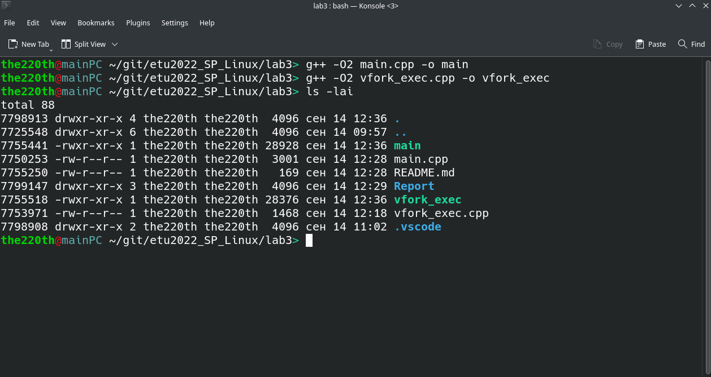
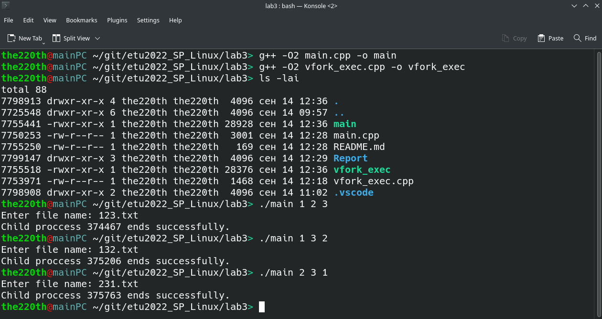
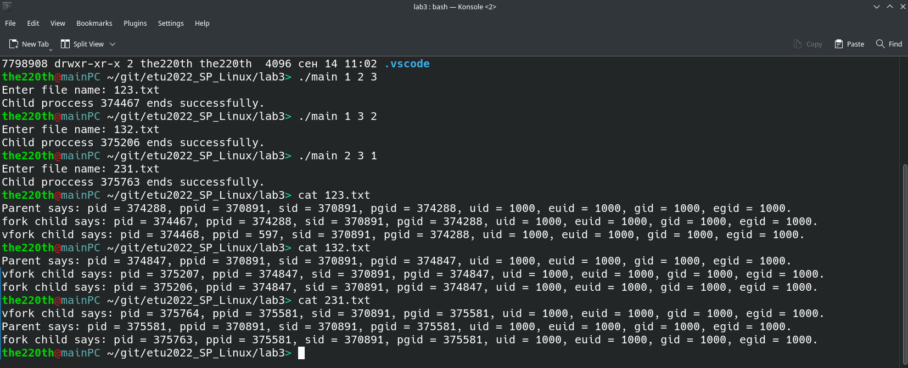

# ВВЕДЕНИЕ

Цель работы: изучение и использование системных функций, обеспечивающих порождение и идентификацию процессов.

Задание:

1. Разработать программу, которая порождает 2 потомка. Первый потомок порождается с помощью fork, второй – с помощью vfork с последующей заменой на другую программу. Все 3 процесса должны вывести в один файл свои атрибуты с предварительным указанием имени процесса (например: Предок, Потомок1, Потомок2). Имя выходного файла задается при запуске программы. Порядок вывода атрибутов в файл должен определяться задержками процессов, которые задаются в качестве параметров программы и выводятся в начало файла.

2. Откомпилировать программу и запустить ее 3 раза с различными сочитаниями задержек.

# Выполнение работы

Компиляция программ приведена на рисунке 1.



Запуск программы с разными временными задержками представлен на рисунке 2.



Пример вывода запущенныз программ представлен на рисунке 3.



Видно, что порядок выводов родителя и потомков соответствует временным задержкам. Также хочется обратить внимание на то, что если процесс-родитель завершит своё выполнение до vfork-потомка, то у vfork-потомка ppid будет равен ppid systemd (init). Это связано с тем, что родитель ожидает завершения fork-потомка, но не ждёт, пока завершится vfork-потомок (см. приложение).

Исходный код программ представлен в приложении.

# ВЫВОД

В результате выполнение лабораторной работы были изучены механизмы порождения процессов с помощью функций fork и vfork и были изучены способы запуска процессов с помощью семейства функций exec. Также были изучены функции идентификации процессов, которые позволяют узнать id процесса, его родителя и другие атрибуты процессов в GNU/Linux.

# Приложение

Исходный код программы `main.cpp`: 

``` cpp
#include <iostream>
#include <stdio.h>
#include <stdlib.h>
#include <sys/types.h>
#include <sys/wait.h>
#include <unistd.h>
#include <fcntl.h>
#include <errno.h>
#include <sstream>

void print_to_file(const char* who, int fd);


int main(int argc, char* argv[])
{
    int buff;
    if(argc != 4)
    {
        std::cout << "Syntax error. Expected: \"> ./main {parent_delay} {fork_delay} {vfork_delay}\"" << std::endl;
        return EXIT_FAILURE;
    }

    unsigned parent_delay = (unsigned)atoi(argv[1]);
    unsigned fork_delay = (unsigned)atoi(argv[2]);
    unsigned vfork_delay = (unsigned)atoi(argv[3]);

    std::string fileName;
    int fd;

    std::cout << "Enter file name: " << std::flush;
    getline(std::cin, fileName);

    fd = open(fileName.c_str(), O_CREAT | O_WRONLY | O_APPEND, S_IRUSR | S_IWUSR);
    //fd = 1 is stdout, fd = 0 is stdin, fd = 2 is stderr
    if(fd < 0)
    {
        perror("Cannot open file");
        return errno;
    }

    int clone_dif = fork();
    if(clone_dif < 0)
    {
        perror("Cannot fork");
        return errno;
    }
    else if(clone_dif == 0)
    {
        sleep(fork_delay);
        print_to_file("fork child", fd);
        return 0;
    }

    int child_pid_fork = clone_dif;

    clone_dif = vfork();
    if(clone_dif < 0)
    {
        perror("Cannot vfork");
        return errno;
    }
    else if(clone_dif == 0)
    {
        // Ничего не трогаем в vfork, кроме exec* и _exit, иначе поведение непредсказуемо
        buff = execl("vfork_exec", "vfork_exec", argv[3], fileName.c_str(), NULL);
        if(buff < 0) // Если вернулись из execl, то уже очень плохо
        {
            perror("Cannot execl");
            _exit(errno);
        }
    }

    sleep(parent_delay);
    int child_exit_status = 0;
    print_to_file("Parent", fd);
    int wait_res = waitpid(child_pid_fork, &child_exit_status, 0);
    if(wait_res < 0)
    {
        perror("Cannot wait fork");
        return errno;
    }
    if(WIFEXITED(child_exit_status))
    {
        std::cout << "Child proccess " << child_pid_fork << " ends successfully. " << std::endl;
    }

    if(close(fd) < 0)
    {
        perror("Cannot close file");
        return errno;
    }
    return 0;
}

void print_to_file(const char* who, int fd)
{
    int pid = getpid();
    int ppid = getppid();
    int sid = getsid(pid);
    int pgid = getpgid(pid);
    unsigned uid = getuid();
    unsigned euid = geteuid();
    unsigned gid = getgid();
    unsigned egid = getegid();

    std::stringstream out;

    out << who << " says: ";
    out << "pid = " << pid << ", ";
    out << "ppid = " << ppid << ", ";
    out << "sid = " << sid << ", ";
    out << "pgid = " << pgid << ", ";
    out << "uid = " << uid << ", euid = " << euid << ", ";
    out << "gid = " << gid << ", egid = " << gid << ". " << std::endl; 

    std::string out_str = out.str();
    write(fd, out_str.c_str(), out_str.length());
}
```

Исходный код программы `vfork_exec.cpp`: 

``` cpp
#include <iostream>
#include <stdio.h>
#include <stdlib.h>
#include <sys/types.h>
#include <sys/wait.h>
#include <unistd.h>
#include <fcntl.h>
#include <errno.h>
#include <sstream>


void print_to_file(const char* who, int fd);

int main(int argc, char* argv[])
{
    if(argc != 3)
    {
        std::cout << "Syntax error. Expected: \"> programm {delay} {filename}\"" << std::endl;
        return EXIT_FAILURE;
    }
    unsigned vfork_delay = (unsigned)atoi(argv[1]);
    const char* fileName = argv[2];

    int fd = open(fileName, O_CREAT | O_WRONLY | O_APPEND, S_IRUSR | S_IWUSR);
    if(fd < 0)
    {
        perror("Cannot open file");
        return errno;
    }

    sleep(vfork_delay);

    print_to_file("vfork child", fd);

    close(fd);

    return 0;
}


void print_to_file(const char* who, int fd)
{
    int pid = getpid();
    int ppid = getppid();
    int sid = getsid(pid);
    int pgid = getpgid(pid);
    unsigned uid = getuid();
    unsigned euid = geteuid();
    unsigned gid = getgid();
    unsigned egid = getegid();

    std::stringstream out;

    out << who << " says: ";
    out << "pid = " << pid << ", ";
    out << "ppid = " << ppid << ", ";
    out << "sid = " << sid << ", ";
    out << "pgid = " << pgid << ", ";
    out << "uid = " << uid << ", euid = " << euid << ", ";
    out << "gid = " << gid << ", egid = " << gid << ". " << std::endl; 

    std::string out_str = out.str();
    write(fd, out_str.c_str(), out_str.length());
}
```