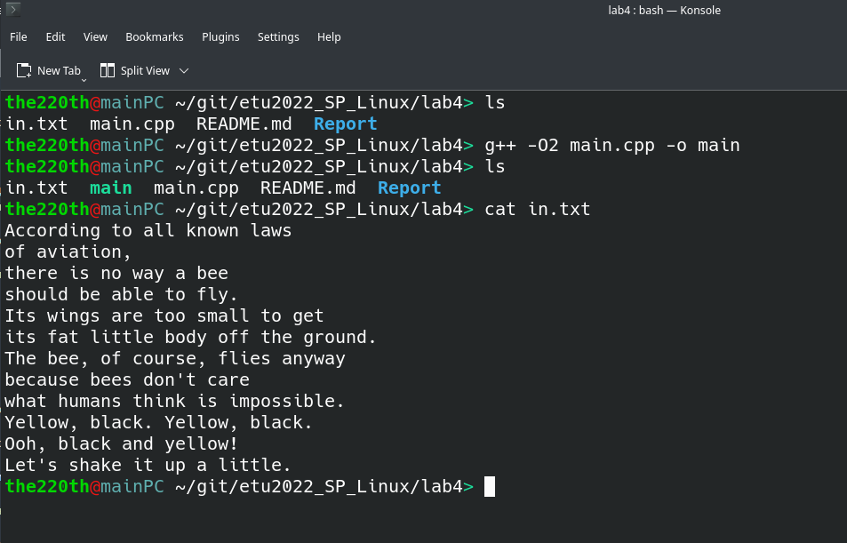
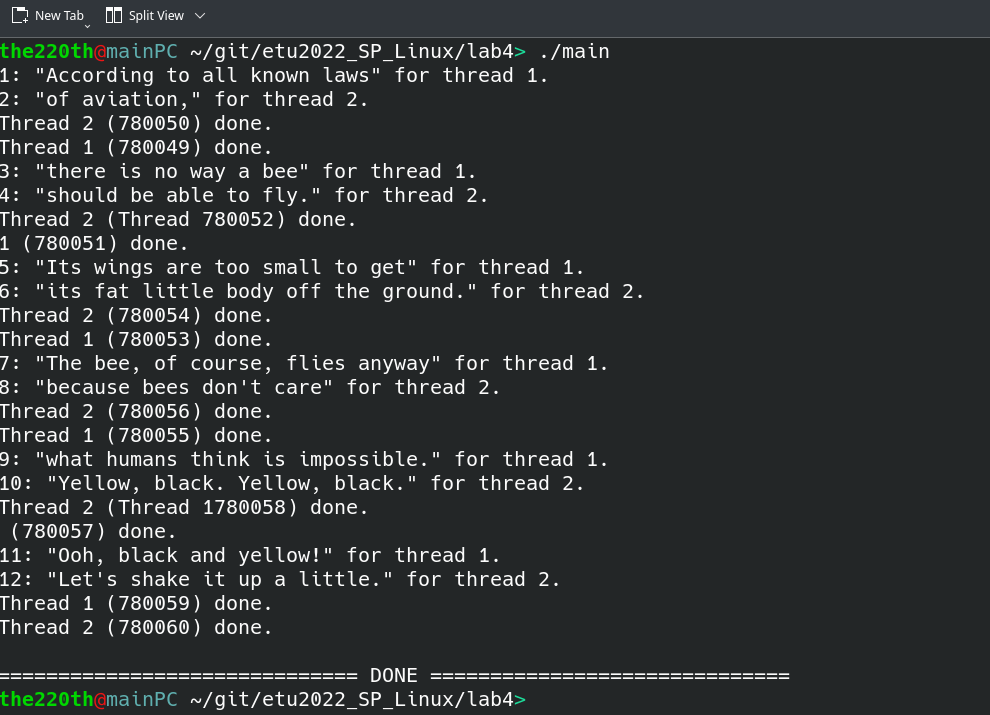
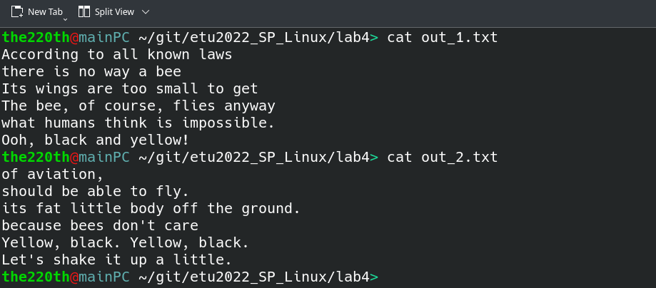

# ВВЕДЕНИЕ

Цель работы:  знакомство с организацией потоков и способами синхронизации предков и потомков.

Задание:

1. Написать программу, которая открывает входной файл и 2 выходных файла. Затем она должна в цикле построчно читать входной файл и порождать 2 потока. Одному потоку передавать нечетную строку, а другому – четную. Оба потока должны работать параллельно. Каждый поток записывает в свой выходной файл полученную строку и завершает работу. Программа должна ожидать завершения работы каждого потока и повторять цикл порождения потоков и чтения строк входного файла, пока не прочтет последнюю строку, после чего закрыть все файлы.

2. Откомпилировать программу и запустить ее.

# Выполнение работы

Компиляция программы и исходный входной файл приведены на рисунке 1.



Пример протокола выполнения программы представлен на рисунке 2.



Содержимое выходных файлов представлено на рисунке 3.



Видно, что потоки сообщая о том, что задача выполнена, не могут поделить файл, файловый дискриптор который равен единице (терминал). Нужна синхронизация потоков.

Исходный код программы представлен в приложении.

# ВЫВОД

В результате выполнение лабораторной работы были изучены механизмы создания потоков и некоторые способы синхронизации потомков и предков в GNU/Linux.

# Приложение

Исходный код программы: 

``` cpp
#include <stdio.h>
#include <stdlib.h>
#include <errno.h>

#include <sys/types.h>
#include <unistd.h>
#include <fcntl.h>

#include <pthread.h>
#include <sys/types.h>

#include <iostream>
#include <fstream>


#define IN_FILE "in.txt"
#define OUT_FILE_1 "out_1.txt"
#define OUT_FILE_2 "out_2.txt"

typedef struct _thargs{
    int th_num;
    std::fstream *f;
    const char *s;
}thargs;

void * start_thread(void * args);

int main(int argc, char* argv[])
{
    std::fstream file_in;
    std::fstream file_out_1;
    std::fstream file_out_2;

    /*
    std::ios::in is read
    std::ios::out is write
    std::ios::app is add std::andl
    std::ios::binary is binary mode
    std::ios::tranc is clear after open
    std::ios::ate is append mode
    */
    file_in.open(IN_FILE, std::ios::in);
    file_out_1.open(OUT_FILE_1, std::ios::out | std::ios::trunc);
    file_out_2.open(OUT_FILE_2, std::ios::out | std::ios::trunc);
    
    pthread_t thread_1 = 0, thread_2 = 0;
    thargs thargs_1, thargs_2;
                                thargs_1.th_num = 1; thargs_2.th_num = 2;
                                thargs_1.f = &file_out_1; thargs_2.f = &file_out_2;
    int pthread_create_return_1, pthread_create_return_2;

    int line_i = 1;
    // Если в файле IN_FILE будет нечётное кол-во строк, то последняя прочтётся, но потоки не создадутся
    for(std::string cur_line_1, cur_line_2; getline(file_in, cur_line_1) && getline(file_in, cur_line_2); line_i+=2)
    {
        std::cout << line_i     << ": \"" << cur_line_1 << "\"" << " for thread 1. " << std::endl;
        std::cout << (line_i+1) << ": \"" << cur_line_2 << "\"" << " for thread 2. " << std::endl;


        thargs_1.s = cur_line_1.c_str();
        pthread_create_return_1 = pthread_create(&thread_1, NULL, &start_thread, &thargs_1);
        if(pthread_create_return_1 != 0)
        {
            perror("Cannot pthread_create");
            return pthread_create_return_1;
        }

        thargs_2.s = cur_line_2.c_str();
        pthread_create_return_2 = pthread_create(&thread_2, NULL, &start_thread, &thargs_2);
        if(pthread_create_return_2 != 0)
        {
            perror("Cannot pthread_create");
            return pthread_create_return_2;
        }


        pthread_join(thread_1, NULL);
        pthread_join(thread_2, NULL);
    }

    file_in.close();
    file_out_1.close();
    file_out_2.close();

    std::cout << "\n============================== DONE ==============================" << std::endl;
    return 0; 
}

void * start_thread(void * args4th)
{
    thargs *args = (thargs*)args4th;

    int th_num = args->th_num;
    std::fstream &file_out = *((*args).f);
    const char *s = (*args).s;
    file_out << s << std::endl;
    std::cout << "Thread " << th_num << " (" << gettid() << ") done. " << std::endl;

    return NULL;
}
```