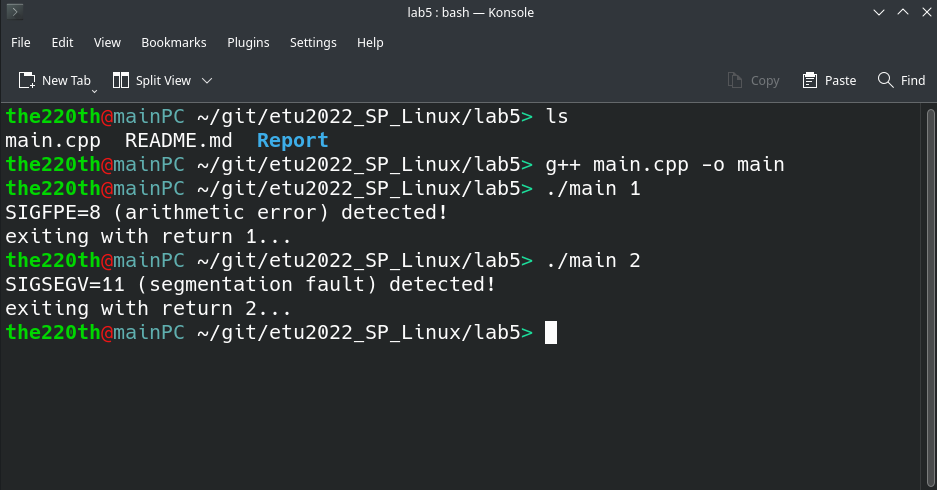

# ВВЕДЕНИЕ

Цель работы: знакомство с механизмом сигналов и способами их обработки.

Задание:

1. Написать программу, которая реагирует на ошибки при выполнении операции деления и неверном использовании указателя (деление на ноль, нарушение защиты памяти). При обнаружении ошибки программа должна передать управление функции, которая выведет сообщение и завершит работу программы с кодом ошибки (1 или 2). Тип ошибки, который должна зафиксировать программа, задается как параметр при ее запуске.

2. Откомпилировать программу и дважды запустить ее с разными значениями типа ошибки.

# Выполнение работы

Пример протокола выполнения программы представлен на рисунке 1.



Видно, что в первом случае сообщение выдал обработчик сигнала отвечающий за SIGFPE (арифмитическая ошибка), во второй раз сообщение выдал уже обработчик, ответственный за SIGSEGV (нарушение защиты памяти).

Исходный код программы представлен в приложении.

# ВЫВОД

В результате выполнение лабораторной работы были изучены механизмы отправки и обработки сигналов в программах в операционной системе GNU/Linux.

# Приложение

Исходный код программы: 

``` cpp
#include <stdio.h>
#include <stdlib.h>
#include <errno.h>

#include <signal.h>

#include <unistd.h>
#include <fcntl.h>
#include <sys/types.h>

#include <iostream>

// arithmetic error ~ SIGFPE
void division_by_zero_handler(int sig);

// mem segmentation error ~ SIGSEGV
void segmentation_fault_handler(int sig);

int set_new_signals_handlers();

int main(int argc, char* argv[])
{
    if(set_new_signals_handlers() < 0)
        return EXIT_FAILURE;
    if(argc != 2)
    {
        std::cout << "Syntax error! Expected: \"> ./main {num_error}\". " << std::endl;
        return EXIT_FAILURE;
    }
    int error_expected = atoi(argv[1]);

    if(error_expected == 1)
    {
        int num = 220;
        int num_another = 221;
        num = num / (num_another-1-num);
    }
    else if(error_expected == 2)
    {
        int* p = NULL;
        std::cout << *p << std::endl;
    }
    else
    {
        std::cout << "No such error. {num_error} must be 1 or 2. " << std::endl;
        return EXIT_FAILURE;
    }

    return 0;
}

int set_new_signals_handlers()
{
    __sighandler_t oldHandler;

    oldHandler = signal(SIGFPE, division_by_zero_handler);
    if(oldHandler == SIG_ERR)
    {
        perror("Signal SIGFPE: ");
        return -1;
    }

    oldHandler = signal(SIGSEGV, segmentation_fault_handler);
    if(oldHandler == SIG_ERR)
    {
        perror("Signal SIGSEGV: ");
        return -1;
    }

    return 0;
}

void division_by_zero_handler(int sig)
{
    std::cout << "SIGFPE=" << sig << " (arithmetic error) detected! " << std::endl;

    std::cout << "exiting with return 1... " << std::endl;

    exit(1);
}

void segmentation_fault_handler(int sig)
{
    std::cout << "SIGSEGV=" << sig << " (segmentation fault) detected! " << std::endl;

    std::cout << "exiting with return 2... " << std::endl;

    exit(2);
}
```