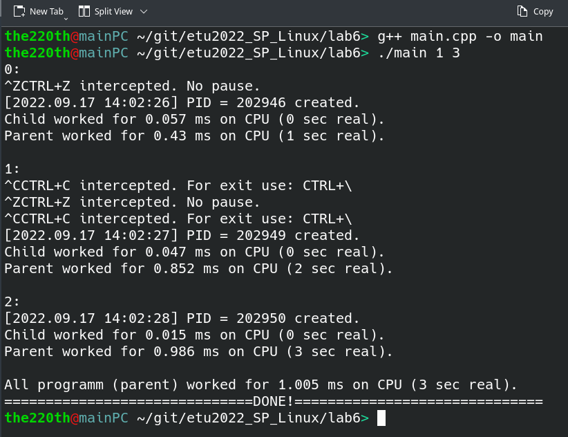
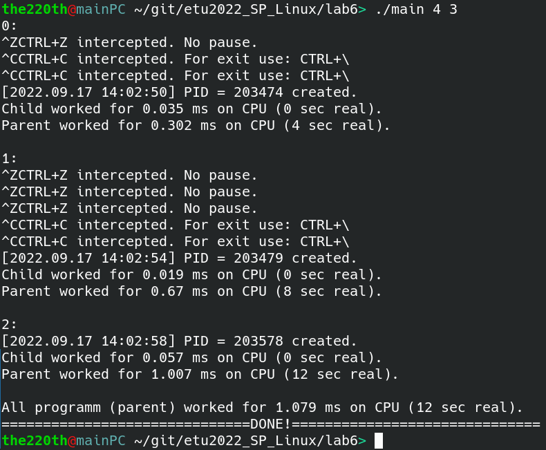
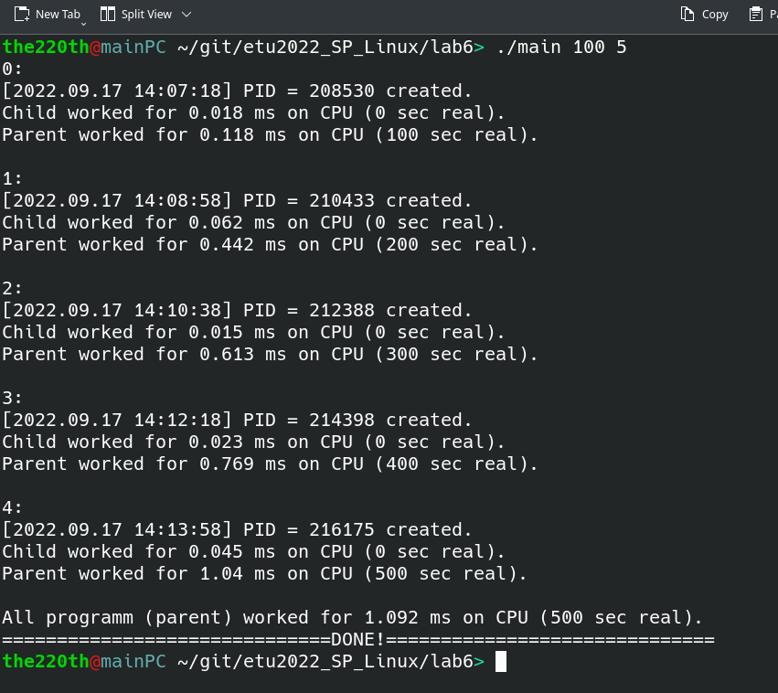

# ВВЕДЕНИЕ

Цель работы:  использование сервиса cron, механизма сигналов и интервальных таймеров для организации периодических процессов. 

Задание:

1. Написать периодическую программу, в которой период запуска и количество запусков должны задаваться в качестве ее параметров. При каждом очередном запуске программа должна порождать новый процесс, который должен выводить на экран свой идентификатор, дату и время старта. Программа и ее дочерний процесс должны быть заблокированы от завершения при нажатии клавиши Ctrl/z. После завершения дочернего процесса программа должна вывести на экран информацию о времени своей работы и дочернего процесса.

2. Откомпилировать программу и запустить ее несколько раз с разным периодом запуска и количеством повторений.

# Выполнение работы

Примеры протоколов выполнения программы представлены на рисунках 1, 2 и 3 соответственно для периода запуска 1 и повторений 3, для периода запуска 4 и повторений 3, для периода запуска 100 и повторений 5.







Программа перехватывает сигналы SIGTSTP и SIGINT. Также на рисунках 1, 2 и 3 видно, что общее время выполнения (не на процессоре), равно ожидаемому.

Исходный код программы представлен в приложении.

# ВЫВОД

В результате выполнение лабораторной работы были изучены механизмы сигналов и интервальных таймеров для организации периодических процессов в ОС GNU/Linux.

# Приложение

Исходный код программы: 

``` cpp
#include <stdio.h>
#include <stdlib.h>
#include <errno.h>

#include <unistd.h>
#include <fcntl.h>
#include <signal.h>
#include <sys/types.h>
#include <sys/time.h>
#include <sys/wait.h>
#include <time.h>

#include <iostream>

// CTR+Z ~ SIGTSTP
void pause_handler(int sig);

// CTR+C ~ SIGINT
void interrupt_handler(int sig);

// ITIMER_REAL ~ SIGALRM
void timer_real_handler(int sig);

int set_new_signals_handlers();

void print_work_time(clock_t gl_b, clock_t gl_e, clock_t ch_b, clock_t ch_e,
                     time_t gl_b_a, time_t gl_e_a, time_t ch_b_a, time_t ch_e_a,
                     bool ifchildtoo = true);

std::string prepare_time();

clock_t child_start_global_var;
time_t child_start_all_global_var;
int ret_handler_num;

int main(int argc, char* argv[])
{
    if(argc != 3)
    {
        std::cout << "Syntax error! Expected: \"> ./main {period in sec} {start_counts}\". " << std::endl;
        return EXIT_FAILURE;
    }
    int period = atoi(argv[1]);
    int counts = atoi(argv[2]);


    if(set_new_signals_handlers() < 0)
        return EXIT_FAILURE;

    struct itimerval tv;
    timerclear(   &(tv.it_interval)   );
    timerclear(   &(tv.it_value)   );
    //tv.it_interval.tv_usec = period; //microsec
    //tv.it_value.tv_usec = period; //microsec
    tv.it_interval.tv_sec = period;
    tv.it_value.tv_sec = period;

    clock_t gl_start = clock();
    time_t gl_start_all = time(NULL);
    clock_t gl_stop;
    time_t gl_stop_all;
    clock_t child_start, child_stop;
    time_t child_start_all, child_stop_all;

    setitimer(ITIMER_REAL, &tv, NULL);
    for(unsigned li = 0; li < counts; ++li)
    {
        std::cout << li << ": " << std::endl;
        ret_handler_num = 1;
        do
        {
            pause();
        }while(ret_handler_num != 0);
        //child_start = clock();
        child_start = child_start_global_var;
        child_start_all = child_start_all_global_var;
        wait(NULL);
        child_stop = clock();
        child_stop_all = time(NULL);
        gl_stop = clock();
        gl_stop_all = time(NULL);
        print_work_time(gl_start, gl_stop, child_start, child_stop,
                        gl_start_all, gl_stop_all, child_start_all, child_stop_all);

        std::cout << std::endl;
    }

    gl_stop = clock();
    gl_stop_all = time(NULL);
    print_work_time(gl_start, gl_stop, 0, 0, gl_start_all, gl_stop_all, 0, 0, false);

    std::cout << "==============================DONE!==============================" << std::endl;

    return 0;
}

void print_work_time(clock_t gl_b, clock_t gl_e, clock_t ch_b, clock_t ch_e,
                     time_t gl_b_a, time_t gl_e_a, time_t ch_b_a, time_t ch_e_a,
                     bool ifchildtoo)
{
    double gl_work = 1000.0*((double)(gl_e-gl_b) / CLOCKS_PER_SEC); // ms
    double ch_work = 1000.0*((double)(ch_e-ch_b) / CLOCKS_PER_SEC); // ms
    long unsigned gl_all_work = gl_e_a-gl_b_a; // sec
    long unsigned ch_all_work = ch_e_a-ch_b_a; // sec

    if(ifchildtoo)
    {
        std::cout << "Child worked for " << ch_work << " ms on CPU (" << ch_all_work << " sec real). " << std::endl;
        std::cout << "Parent worked for " << gl_work << " ms on CPU (" << gl_all_work << " sec real). " << std::endl;
    }
    else
        std::cout << "All programm (parent) worked for " << gl_work << " ms on CPU (" << gl_all_work << " sec real). " << std::endl;
}

std::string prepare_time()
{
    time_t current_time = time(NULL);
    struct tm* t;
    t = localtime(&current_time);
    std::string ms, s, m, h, D, M, Y;
    //ms = std::to_string(current_time);
    s = std::to_string(t->tm_sec);
    m = std::to_string(t->tm_min);
    h = std::to_string(t->tm_hour);
    D = std::to_string(t->tm_mday);
    M = std::to_string(t->tm_mon + 1);
    Y = std::to_string(t->tm_year + 1900);

    if (t->tm_sec < 10) s = "0" + s;
    if (t->tm_min < 10) m = "0" + m;
    if (t->tm_hour < 10) h = "0" + h;
    if (t->tm_mday < 10) D = "0" + D;
    if (t->tm_mon + 1 < 10) M = "0" + M;

    std::string res =
        "[" + Y + "." + M + "." + D + " " + h + ":" + m + ":" + s + "] ";

    return res;
}

int set_new_signals_handlers()
{
    __sighandler_t oldHandler;

    // signal(SIGTSTP, SIG_IGN);
    oldHandler = signal(SIGTSTP, pause_handler);
    if(oldHandler == SIG_ERR)
    {
        perror("Signal SIGTSTP: ");
        return -1;
    }

    // signal(SIGINT, SIG_IGN);
    oldHandler = signal(SIGINT, interrupt_handler);
    if(oldHandler == SIG_ERR)
    {
        perror("Signal SIGINT: ");
        return -1;
    }

    oldHandler = signal(SIGALRM, timer_real_handler);
    if(oldHandler == SIG_ERR)
    {
        perror("Signal SIGALRM: ");
        return -1;
    }

    return 0;
}

void pause_handler(int sig)
{
    std::cout << "CTRL+Z intercepted. No pause. " << std::endl;
}

void interrupt_handler(int sig)
{
    std::cout << "CTRL+C intercepted. For exit use: CTRL+\\ " << std::endl;
}
void timer_real_handler(int sig)
{
    ret_handler_num = 0;
    /*
    if fork() == 0, then all interval timers are cleared, so fork here=/
    # https://www.opennet.ru/man.shtml?topic=fork&category=2&russian=1
    */
    pid_t diff = fork();
    if(diff == 0)
    {
        std::cout << prepare_time() << "PID = " << getpid() << " created. " << std::endl;
        exit(EXIT_SUCCESS);
    }
    else if(diff > 0)
    {
        child_start_global_var = clock();
        child_start_all_global_var = time(NULL);
    }
    else
    {
        perror("Cannot fork");
        exit(EXIT_FAILURE);
    }
}
```