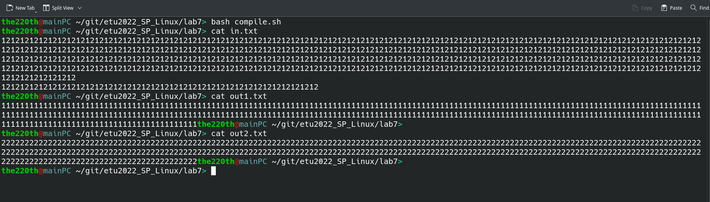

# ВВЕДЕНИЕ

Цель работы: знакомство с механизмом обмена данными через программный канал и системными вызовами, обеспечивающими такой обмен. 

Задание:

1. Написать программу, которая обменивается данными через канал с двумя потомками. Программа открывает входной файл, построчно читает из него данные и записывает их в канал. Потомки выполняют свои программы и поочередно читают символы из канала и записывают их в свои выходные файлы: первый потомок – нечетные символы, а второй – четные. Синхронизация работы потомков должна осуществляться напрямую с использованием сигналов SIGUSR1 и SIGUSR2. Об окончании записи файла в канал программа оповещает потомков сигналом SIGQUIT и ожидает завершения работы потомков. Когда они заканчивают работу, программа закрывает канал.

2. Откомпилировать все программы и запустить их.

# Выполнение работы

Пример протокола выполнения программы представлен на рисунке 1.


Содержимое входного и выходных файлов представлено на рисунке 2.



Программа после того, как канал создан, а файлы открыты предок с помощь `fork` порождает 2 потомка, которые сразу переопределяют обработчика сигнала для сигналов `SIGUSR1` и `SIGUSR2`. Они по очереди читают байт из канала, а после этого генерируют сигнал другому потомку. Так происходит до тех пор, пока файл не закончится.

Исходный код программы представлен в приложении.

# ВЫВОД

В результате выполнение лабораторной работы было проведено знакомство с механизмом обмена данными через программный канал и системными вызовами, обеспечивающими такой обмен, в ОС GNU/Linux.

# Приложение

Листинг файла `parent.cpp`: 

``` cpp
#include <stdio.h>
#include <stdlib.h>
#include <errno.h>

#include <unistd.h>
#include <fcntl.h>
#include <signal.h>
#include <sys/types.h>
#include <sys/time.h>
#include <sys/wait.h>
#include <time.h>

#include <iostream>


#define BUFF_LEN 256*1024
#define IN_FINE "./in.txt"
#define OUT_FILE1 "./out1.txt"
#define OUT_FILE2 "./out2.txt"


// ===== PARENT ====

int main_parent(int fd_file_r, int fd_pipe_w, pid_t ch_pid_1, pid_t ch_pid_2);

int set_new_signals_handlers();

// ===== PARENT ====

// ===== COMMON ====

// pipe broken ~ SIGPIPE
int set_new_signals_handlers();

void broken_pipe_handler(int sig);
void q_handler(int sig);

int open_files(int &fd_r, int &fd_w1, int &fd_w2);

// ===== COMMON ====

int main(int argc, char* argv[])
{    
    int pipe_fds[2];
    int &read_pipe_fd = pipe_fds[0];
    int &write_pipe_fd = pipe_fds[1];
    int fd_infile, fd_outfile1, fd_outfile2;
    int buff;
    pid_t diff, pid_ch1, pid_ch2;


    if(set_new_signals_handlers() < 0)
        return EXIT_FAILURE;
    if(pipe(pipe_fds) == -1)
    {
        perror("Cannot open pipe");
        return errno;
    }
    else
    {
        if(fcntl(read_pipe_fd, F_SETFL, O_NONBLOCK) < 0)
        {
            perror("Cannot set O_NONBLOCK on pipe");
            return errno;
        }
    }
    buff = open_files(fd_infile, fd_outfile1, fd_outfile2);
    //std::cout << fd_infile << " " << fd_outfile1 << " " << fd_outfile2 << std::endl;
    if(buff < 0)
        return buff;
    
    const char* fd_outfile1_cstr = std::to_string(fd_outfile1).c_str();
    const char* fd_outfile2_cstr = std::to_string(fd_outfile2).c_str();
    const char* read_pipe_fd_cstr = std::to_string(read_pipe_fd).c_str();


    diff = vfork();
    if(diff == 0)
    {
        buff = execl("child1", "child1", fd_outfile1_cstr, read_pipe_fd_cstr, NULL);
        if(buff < 0)
        {
            perror("Cannot execl");
            _exit(EXIT_FAILURE);
        }
    }
    else if(diff < 0)
    {
        perror("Cannot vfork 1");
        exit(EXIT_FAILURE);
    }
    pid_ch1 = diff;

    diff = vfork();
    if(diff == 0)
    {
        buff = execl("child2", "child2", fd_outfile2_cstr, read_pipe_fd_cstr, NULL);
        if(buff < 0)
        {
            perror("Cannot execl");
            _exit(EXIT_FAILURE);
        }
    }
    else if(diff < 0)
    {
        perror("Cannot vfork 2");
        exit(EXIT_FAILURE);
    }
    pid_ch2 = diff;
    
    main_parent(fd_infile, write_pipe_fd, pid_ch1, pid_ch2);

    std::cout << "Closing all file desctiptors... " << std::endl;
    if(   !(close(fd_infile) == 0 && close(fd_outfile1) == 0 && close(fd_outfile2) == 0 && close(read_pipe_fd) == 0 && close(write_pipe_fd) == 0)   )
    {
        std::cout << "!!! Some file could not be closed !!!" << std::endl;
        return EXIT_FAILURE;
    }

    std::cout << "============================== DONE! ==============================" << std::endl;
    return 0;
}

int open_files(int &fd_r, int &fd_w1, int &fd_w2)
{
    fd_r = open(IN_FINE, O_RDONLY);
    if(fd_r < 0)
    {
        perror("Cannot open read file");
        return errno;
    }

    fd_w1 = open(OUT_FILE1, O_CREAT | O_WRONLY | O_TRUNC, S_IRUSR | S_IWUSR);
    if(fd_w1 < 0)
    {
        perror("Cannot open write1 file");
        return errno;
    }

    fd_w2 = open(OUT_FILE2, O_CREAT | O_WRONLY | O_TRUNC, S_IRUSR | S_IWUSR);
    if(fd_w2 < 0)
    {
        perror("Cannot open write2 file");
        return errno;
    }

    return 0;
}

int set_new_signals_handlers()
{
    __sighandler_t oldHandler;

    // signal(SIGPIPE, SIG_IGN);
    oldHandler = signal(SIGPIPE, broken_pipe_handler);
    if(oldHandler == SIG_ERR)
    {
        perror("Signal SIGPIPE: ");
        return -1;
    }

    oldHandler = signal(SIGUSR1, SIG_IGN);
    if(oldHandler == SIG_ERR)
    {
        perror("Signal SIGUSR1: ");
        return -1;
    }

    oldHandler = signal(SIGUSR2, SIG_IGN);
    if(oldHandler == SIG_ERR)
    {
        perror("Signal SIGUSR2: ");
        return -1;
    }

    oldHandler = signal(SIGQUIT, SIG_IGN);
    if(oldHandler == SIG_ERR)
    {
        perror("Signal SIGQUIT: ");
        return -1;
    }

    return 0;
}

void broken_pipe_handler(int sig)
{
    std::cout << "Pipe broken! " << std::endl;
}

int main_parent(int fd_file_r, int fd_pipe_w, pid_t ch_pid_1, pid_t ch_pid_2)
{
    sleep(1);
    unsigned char readBUFF[BUFF_LEN];
    unsigned char c;
    unsigned readed = 0;

    std::cout << "Parent writing and children reading..." << std::endl;
    while(read(fd_file_r, &c, 1) != 0)
    {
        if(c == '\n')
        {
            write(fd_pipe_w, readBUFF, readed);
            //write(1, readBUFF, readed);

            readed = 0;
            //sleep(1);
        }
        else
        {
            readBUFF[readed++] = c;
        }
    }
    if(readed > 0)
        write(fd_pipe_w, readBUFF, readed);
    std::cout << std::endl << "Readed! " << std::endl;

    //sleep(1);

    std::cout << "\n\"Killing\" ch1..." << std::endl;
    if(kill(ch_pid_1, SIGQUIT) < 0)
    {
        perror("Cannot kill ch_1");
        return -1;
    }

    std::cout << "\n\"Killing\" ch2..." << std::endl;
    if(kill(ch_pid_2, SIGQUIT) < 0)
    {
        perror("Cannot kill ch_2");
        return -1;
    }

    std::cout << "\nWaiting while \"kill\" ch1..." << std::endl;
    if(waitpid(ch_pid_1, NULL, 0) < 0)
    {
        perror("Cannot wait ch_1");
        return -1;
    }

    std::cout << "\nWaiting while \"kill\" ch2..." << std::endl;
    if(waitpid(ch_pid_2, NULL, 0) < 0)
    {
        perror("Cannot wait ch_2");
        return -1;
    }

    return 0;
}
```

Листинг файла `child1.cpp`: 

``` cpp
#include <stdio.h>
#include <stdlib.h>
#include <errno.h>

#include <unistd.h>
#include <fcntl.h>
#include <signal.h>
#include <sys/types.h>
#include <sys/time.h>
#include <sys/wait.h>
#include <time.h>

#include <iostream>


#define IS_I_FIRST true
#define WHAT_REC SIGUSR2
#define WHAT_THROW SIGUSR1


// ===== CHILD ====

int main_child(int fd_file_w, int fd_pipe_r, bool first_second_ch);

void process_handler(int sig);

int globalvar_parent_exit_flag;
bool globalvar_another_ch_ready;

// ===== CHILD ====

void q_handler(int sig);
/*
argv:
0 - programm name
1 - fd file out
2 - fd pipe in
*/
int main(int argc, char* argv[])
{
    int fd_file_w = atoi(argv[1]); 
    int fd_pipe_r = atoi(argv[2]);

    bool end_flag = 0;
    globalvar_parent_exit_flag = 0;

    __sighandler_t oldHandler;
    oldHandler = signal(WHAT_REC, process_handler);
    if(oldHandler == SIG_ERR)
    {
        perror("Signal SIGPIPE: ");
        _exit(EXIT_FAILURE);
    }
    oldHandler = signal(SIGQUIT, q_handler);
    if(oldHandler == SIG_ERR)
    {
        perror("Signal SIGQUIT: ");
        return -1;
    }

    globalvar_another_ch_ready = IS_I_FIRST;

    int read_ret;
    unsigned char c;

    while(   !(globalvar_parent_exit_flag == 1 && end_flag == 1)   )
    {
        if(globalvar_another_ch_ready == false)
            continue;
        else
        {
            do
            {
                read_ret = read(fd_pipe_r, &c, 1);
                if(read_ret <= 0)
                {
                    //sleep(1);
                    //std::cout << first_second_ch << " " << globalvar_parent_exit_flag << ": " << std::flush;
                    //perror("read pipe");
                }
                if((read_ret <= 0) && globalvar_parent_exit_flag == 1)
                {
                    end_flag = 1;
                    break;
                }
            }while(read_ret <= 0);

            if(read_ret > 0)
            {
                write(fd_file_w, &c, 1);
                write(1, &c, 1);
            }
            globalvar_another_ch_ready = false;
        }

        kill(0, WHAT_THROW);
    }

    return 0;
}

void q_handler(int sig)
{
    globalvar_parent_exit_flag = 1;
}

void process_handler(int sig)
{
    globalvar_another_ch_ready = true;
}
```

Листинг файла `child2.cpp`: 

``` cpp
#include <stdio.h>
#include <stdlib.h>
#include <errno.h>

#include <unistd.h>
#include <fcntl.h>
#include <signal.h>
#include <sys/types.h>
#include <sys/time.h>
#include <sys/wait.h>
#include <time.h>

#include <iostream>


#define IS_I_FIRST false
#define WHAT_REC SIGUSR1
#define WHAT_THROW SIGUSR2


// ===== CHILD ====

int main_child(int fd_file_w, int fd_pipe_r, bool first_second_ch);

void process_handler(int sig);

int globalvar_parent_exit_flag;
bool globalvar_another_ch_ready;

// ===== CHILD ====

void q_handler(int sig);
/*
argv:
0 - programm name
1 - fd file out
2 - fd pipe in
*/
int main(int argc, char* argv[])
{
    int fd_file_w = atoi(argv[1]); 
    int fd_pipe_r = atoi(argv[2]);

    bool end_flag = 0;
    globalvar_parent_exit_flag = 0;

    __sighandler_t oldHandler;
    oldHandler = signal(WHAT_REC, process_handler);
    if(oldHandler == SIG_ERR)
    {
        perror("Signal SIGPIPE: ");
        _exit(EXIT_FAILURE);
    }
    oldHandler = signal(SIGQUIT, q_handler);
    if(oldHandler == SIG_ERR)
    {
        perror("Signal SIGQUIT: ");
        return -1;
    }

    globalvar_another_ch_ready = IS_I_FIRST;

    int read_ret;
    unsigned char c;

    while(   !(globalvar_parent_exit_flag == 1 && end_flag == 1)   )
    {
        if(globalvar_another_ch_ready == false)
            continue;
        else
        {
            do
            {
                read_ret = read(fd_pipe_r, &c, 1);
                if(read_ret <= 0)
                {
                    //sleep(1);
                    //std::cout << first_second_ch << " " << globalvar_parent_exit_flag << ": " << std::flush;
                    //perror("read pipe");
                }
                if((read_ret <= 0) && globalvar_parent_exit_flag == 1)
                {
                    end_flag = 1;
                    break;
                }
            }while(read_ret <= 0);

            if(read_ret > 0)
            {
                write(fd_file_w, &c, 1);
                write(1, &c, 1);
            }
            globalvar_another_ch_ready = false;
        }

        kill(0, WHAT_THROW);
    }

    return 0;
}

void q_handler(int sig)
{
    globalvar_parent_exit_flag = 1;
}

void process_handler(int sig)
{
    globalvar_another_ch_ready = true;
}
```