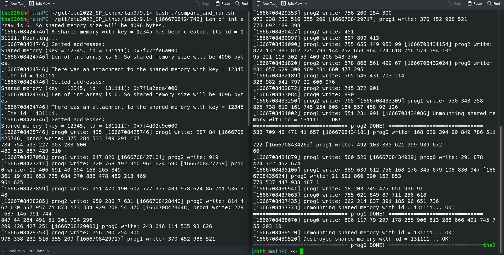
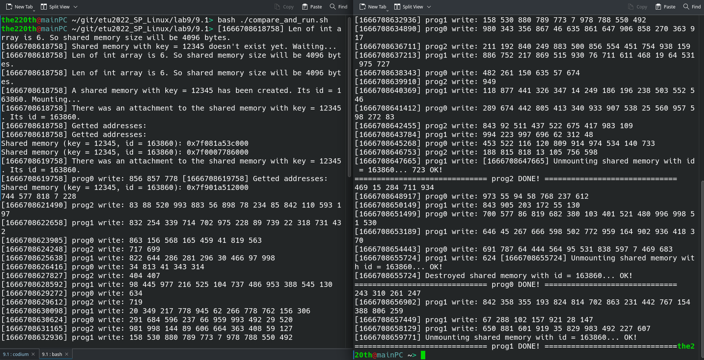

# ВВЕДЕНИЕ

Цель работы: знакомство с организацией разделяемой памяти и системными функциями, обеспечивающими обмен данными между процессами. 

Задание:

1. Написать две программы, которые работают параллельно и обмениваются массивом целых чисел через две общие разделяемые области. Через первую область первая программа передает массив второй программе. Через вторую область вторая программа возвращает первой программе массив, каждый элемент которого уменьшен на 1. Обе программы должны вывести получаемую последовательность чисел. Синхронизация работы программ должна осуществляться с помощью общих переменных, размещенных в разделяемой памяти.

2. Откомпилировать 2 программы и запустить их на разных терминалах.

# Выполнение работы

Примеры протоколов выполнения программ представлены на рисунках 1 и 2.





Как видно, номера программ перепутаны: вторая программа пишет массив, а первая его декрементирует. Программы имеют синхронизацию как ожидание создания разделяемой памяти друг другом, так и синхронизация, что запись уже закончена. Сам массив чисел рандомный, поменять кол-во элементов можно в программе, поменяв define ARRAY_LEN.

Исходный код программ представлен в приложении.

# ВЫВОД

В результате выполнение лабораторной работы было проведено знакомство с организацией разделяемой памяти и системными функциями, обеспечивающими обмен данными между процессами, в ОС GNU/Linux.

# Приложение

Исходный код программы `prog1`:

``` cpp
#include <stdio.h>
#include <stdlib.h>
#include <errno.h>

#include <unistd.h>
#include <fcntl.h>
#include <signal.h>
#include <sys/types.h>
#include <sys/time.h>
#include <sys/ipc.h>
#include <sys/shm.h>
#include <sys/wait.h>
#include <time.h>

#include <iostream>
#include <chrono>
#include <string>

#define PROG_NUM 0
#define ARRAY_LEN 30


const int step_1_end_notification = 5051;
const int step_2_end_notification = 235112329;

/*
Создаёт виртуальную память, если есть новая по ключу shmem_key_1 и монтирует её
Пытает примонтировать память по ключу shmem_key_2
В shmem_p_1 помещается указатель на виртуальную память с ключом shmem_key_1
В shmem_p_2 помещается указатель на виртуальную память с ключом shmem_key_2
Возвращает id виртуальной памяти с ключом shmem_key_1
*/
int create_mount(int shmem_key_1, int shmem_key_2, int **shmem_p_1, int **shmem_p_2);

std::string get_cur_time();

/*
> ./main {shared_mem_key_1} {shared_mem_key_2}
*/
int main(int argc, char* argv[])
{
    srandom(time(NULL));
    if(argc != 3)
    {
        std::cout << "Syntax error. Expected: \"> ./main {prognum_num} {shared_mem_key_1} {shared_mem_key_2}\"" << std::endl;
        exit(EXIT_FAILURE);
    }
    const unsigned my_num = PROG_NUM;
    const int shmem_key_1 = atoi(argv[1]);
    const int shmem_key_2 = atoi(argv[2]);
    if(   !(my_num == 0 || my_num == 1)   )
    {
        std::cout << "{prognum_num} must be 0 or 1. " << std::endl;
        exit(EXIT_FAILURE);
    }
    if(shmem_key_1 <= 0)
    {
        std::cout << "{shared_mem_key_1} must be possitive. " << std::endl;
        exit(EXIT_FAILURE);
    }
    if(shmem_key_2 <= 0)
    {
        std::cout << "{shared_mem_key_2} must be possitive. " << std::endl;
        exit(EXIT_FAILURE);
    }

    int *shmem_p_1, *shmem_p_2;
    int shmem_id = create_mount(shmem_key_1, shmem_key_2, &shmem_p_1, &shmem_p_2);
    std::cout << get_cur_time() << "Getted addresses:" << std::endl;
    std::cout << "Shared memory (key = " << shmem_key_1 << ", id = " << shmem_id << "): " << shmem_p_1 << std::endl;
    std::cout << "Shared memory (key = " << shmem_key_1 << "): " << shmem_p_2 << std::endl;

    int arrrrrr[ARRAY_LEN];
    int *p;


        *shmem_p_1 = 0;
        while(*shmem_p_2 != step_1_end_notification)
        {
            std::cout << get_cur_time() << "Another program has not finished yet. Waiting... " << std::endl;
            sleep(1);
        }
        std::cout << get_cur_time() << "Another program finished its job. " << std::endl;

        std::cout << get_cur_time() << "Reading array from " << shmem_p_2 << ": \n[" << std::flush;
        p = shmem_p_2; ++p;
        for(unsigned li = 0; li < ARRAY_LEN; ++li, ++p)
        {
            arrrrrr[li] = *p;
            std::cout << arrrrrr[li] << ", ";
        }
        std::cout << "\b\b] " << std::endl;

        std::cout << get_cur_time() << "Decrementing... " << std::flush;
        for(unsigned li = 0; li < ARRAY_LEN; ++li) --arrrrrr[li];
        std::cout << "Decremented! " << std::endl;

        std::cout << get_cur_time() << "Writing array to shared memory at " << shmem_p_1 << "... " << std::endl;
        p = shmem_p_1; ++p;
        for(unsigned li = 0; li < ARRAY_LEN; ++li, ++p) *p = arrrrrr[li];
        std::cout << get_cur_time() << "Writing done! " << std::endl;
        *shmem_p_1 = step_2_end_notification;


    std::cout << get_cur_time() << "Destroyed shared memory with id = " << shmem_id << "... " << std::flush;
    shmctl(shmem_id, IPC_RMID, NULL);
    std::cout << "OK! " << std::endl;

    std::cout << "============================== DONE! ==============================" << std::endl;
    return 0;
}


int create_mount(int shmem_key_1, int shmem_key_2, int **shmem_p_1, int **shmem_p_2)
{
    const unsigned page_sz = 4*1024; // размер страницы 4 кБ
    int buff;
    int *buffp;
    int shmem_id_1;
    const unsigned needed_bytes = (ARRAY_LEN+1)*4;
    const unsigned shmem_len = (needed_bytes%page_sz==0?needed_bytes:(needed_bytes/page_sz)*page_sz+page_sz);
    
    std::cout << get_cur_time() << "Len of int array is " << ARRAY_LEN << " + sync int. Total int needed: " << (ARRAY_LEN+1) << ". So shared memory size will be " << shmem_len << " bytes. " << std::endl;
    
    buff = shmget(shmem_key_1, shmem_len, 0666 | IPC_CREAT | IPC_EXCL);
    if(buff == -1)
    {
        std::cout << "Cannot create shared memory with key = " << shmem_key_1 << ", because it is already exist, choose another one" << std::endl;
        perror("shmget failed");
        exit(EXIT_FAILURE);
    }
    shmem_id_1 = buff;
    std::cout << get_cur_time() << "A shared memory with key =  " << shmem_key_1 << " has been created. Its id = " << buff << ". Mounting... " << std::endl;
    
    buffp = (int*)shmat(buff, NULL, 0);
    if(buffp == NULL)
    {
        std::cout << "Cannot mount=<" << std::endl;
        perror("shmat failed");
        exit(EXIT_FAILURE);
    }
    *shmem_p_1 = buffp;

    do
    {
        buff = shmget(shmem_key_2, shmem_len, IPC_EXCL);
        if(buff == -1)
        {
            std::cout << get_cur_time() << "Shared memory with key = " << shmem_key_2 << " doesn't exist yet. Waiting..." << std::endl;
            sleep(1);
        }
    }while(buff == -1);
    buffp = (int*)shmat(buff, NULL, 0);
    std::cout << get_cur_time() << "There was an attachment to the shared memory with key = " << shmem_key_2 << ". Its id = " << buff << ". " << std::endl;
    *shmem_p_2 = buffp;

    return shmem_id_1;
}

std::string get_cur_time()
{
    long long long_long_long_long_very_long_value_long_long = std::chrono::duration_cast<std::chrono::milliseconds>(std::chrono::time_point_cast<std::chrono::milliseconds>(std::chrono::high_resolution_clock::now()).time_since_epoch()).count();
    return "[" + std::to_string(long_long_long_long_very_long_value_long_long) + "] ";
}
```

Исходный код программы `prog2`:

``` cpp
#include <stdio.h>
#include <stdlib.h>
#include <errno.h>

#include <unistd.h>
#include <fcntl.h>
#include <signal.h>
#include <sys/types.h>
#include <sys/time.h>
#include <sys/ipc.h>
#include <sys/shm.h>
#include <sys/wait.h>
#include <time.h>

#include <iostream>
#include <chrono>
#include <string>

#define PROG_NUM 1
#define ARRAY_LEN 30


const int step_1_end_notification = 5051;
const int step_2_end_notification = 235112329;

/*
Создаёт виртуальную память, если есть новая по ключу shmem_key_1 и монтирует её
Пытает примонтировать память по ключу shmem_key_2
В shmem_p_1 помещается указатель на виртуальную память с ключом shmem_key_1
В shmem_p_2 помещается указатель на виртуальную память с ключом shmem_key_2
Возвращает id виртуальной памяти с ключом shmem_key_1
*/
int create_mount(int shmem_key_1, int shmem_key_2, int **shmem_p_1, int **shmem_p_2);

std::string get_cur_time();

/*
> ./main {shared_mem_key_1} {shared_mem_key_2}
*/
int main(int argc, char* argv[])
{
    srandom(time(NULL));
    if(argc != 3)
    {
        std::cout << "Syntax error. Expected: \"> ./main {prognum_num} {shared_mem_key_1} {shared_mem_key_2}\"" << std::endl;
        exit(EXIT_FAILURE);
    }
    const unsigned my_num = PROG_NUM;
    const int shmem_key_1 = atoi(argv[1]);
    const int shmem_key_2 = atoi(argv[2]);
    if(   !(my_num == 0 || my_num == 1)   )
    {
        std::cout << "{prognum_num} must be 0 or 1. " << std::endl;
        exit(EXIT_FAILURE);
    }
    if(shmem_key_1 <= 0)
    {
        std::cout << "{shared_mem_key_1} must be possitive. " << std::endl;
        exit(EXIT_FAILURE);
    }
    if(shmem_key_2 <= 0)
    {
        std::cout << "{shared_mem_key_2} must be possitive. " << std::endl;
        exit(EXIT_FAILURE);
    }

    int *shmem_p_1, *shmem_p_2;
    int shmem_id = create_mount(shmem_key_1, shmem_key_2, &shmem_p_1, &shmem_p_2);
    std::cout << get_cur_time() << "Getted addresses:" << std::endl;
    std::cout << "Shared memory (key = " << shmem_key_1 << ", id = " << shmem_id << "): " << shmem_p_1 << std::endl;
    std::cout << "Shared memory (key = " << shmem_key_1 << "): " << shmem_p_2 << std::endl;

    int arrrrrr[ARRAY_LEN];
    int *p;


        *shmem_p_1 = 0;
        std::cout << get_cur_time() << "Generating array: \n[" << std::flush;
        for(unsigned li = 0; li < ARRAY_LEN; ++li)
        {
            arrrrrr[li] = random() % 100+1;
            std::cout << arrrrrr[li] << ", ";
        }
        std::cout << "\b\b] " << std::endl;

        std::cout << get_cur_time() << "Writing array to shared memory at " << shmem_p_1 << "... " << std::endl;
        p = shmem_p_1; ++p;
        for(unsigned li = 0; li < ARRAY_LEN; ++li, ++p) *p = arrrrrr[li];
        std::cout << get_cur_time() << "Writing done! " << std::endl;
        *shmem_p_1 = step_1_end_notification;

        while(*shmem_p_2 != step_2_end_notification)
        {
            std::cout << get_cur_time() << "Another program has not finished yet. Waiting... " << std::endl;
            sleep(1);
        }
        std::cout << get_cur_time() << "Another program finished its job. " << std::endl;

        std::cout << get_cur_time() << "Reading array from shared memory at " << shmem_p_2 << ": \n[" << std::flush;
        p = shmem_p_2; ++p;
        for(unsigned li = 0; li < ARRAY_LEN; ++li, ++p)
        {
            arrrrrr[li] = *p;
            std::cout << arrrrrr[li] << ", ";
        }
        std::cout << "\b\b] " << std::endl;


    std::cout << get_cur_time() << "Destroyed shared memory with id = " << shmem_id << "... " << std::flush;
    shmctl(shmem_id, IPC_RMID, NULL);
    std::cout << "OK! " << std::endl;

    std::cout << "============================== DONE! ==============================" << std::endl;
    return 0;
}


int create_mount(int shmem_key_1, int shmem_key_2, int **shmem_p_1, int **shmem_p_2)
{
    const unsigned page_sz = 4*1024; // размер страницы 4 кБ
    int buff;
    int *buffp;
    int shmem_id_1;
    const unsigned needed_bytes = (ARRAY_LEN+1)*4;
    const unsigned shmem_len = (needed_bytes%page_sz==0?needed_bytes:(needed_bytes/page_sz)*page_sz+page_sz);
    
    std::cout << get_cur_time() << "Len of int array is " << ARRAY_LEN << " + sync int. Total int needed: " << (ARRAY_LEN+1) << ". So shared memory size will be " << shmem_len << " bytes. " << std::endl;
    
    buff = shmget(shmem_key_1, shmem_len, 0666 | IPC_CREAT | IPC_EXCL);
    if(buff == -1)
    {
        std::cout << "Cannot create shared memory with key = " << shmem_key_1 << ", because it is already exist, choose another one" << std::endl;
        perror("shmget failed");
        exit(EXIT_FAILURE);
    }
    shmem_id_1 = buff;
    std::cout << get_cur_time() << "A shared memory with key =  " << shmem_key_1 << " has been created. Its id = " << buff << ". Mounting... " << std::endl;
    
    buffp = (int*)shmat(buff, NULL, 0);
    if(buffp == NULL)
    {
        std::cout << "Cannot mount=<" << std::endl;
        perror("shmat failed");
        exit(EXIT_FAILURE);
    }
    *shmem_p_1 = buffp;

    do
    {
        buff = shmget(shmem_key_2, shmem_len, IPC_EXCL);
        if(buff == -1)
        {
            std::cout << get_cur_time() << "Shared memory with key = " << shmem_key_2 << " doesn't exist yet. Waiting..." << std::endl;
            sleep(1);
        }
    }while(buff == -1);
    buffp = (int*)shmat(buff, NULL, 0);
    std::cout << get_cur_time() << "There was an attachment to the shared memory with key = " << shmem_key_2 << ". Its id = " << buff << ". " << std::endl;
    *shmem_p_2 = buffp;

    return shmem_id_1;
}

std::string get_cur_time()
{
    long long long_long_long_long_very_long_value_long_long = std::chrono::duration_cast<std::chrono::milliseconds>(std::chrono::time_point_cast<std::chrono::milliseconds>(std::chrono::high_resolution_clock::now()).time_since_epoch()).count();
    return "[" + std::to_string(long_long_long_long_very_long_value_long_long) + "] ";
}
```